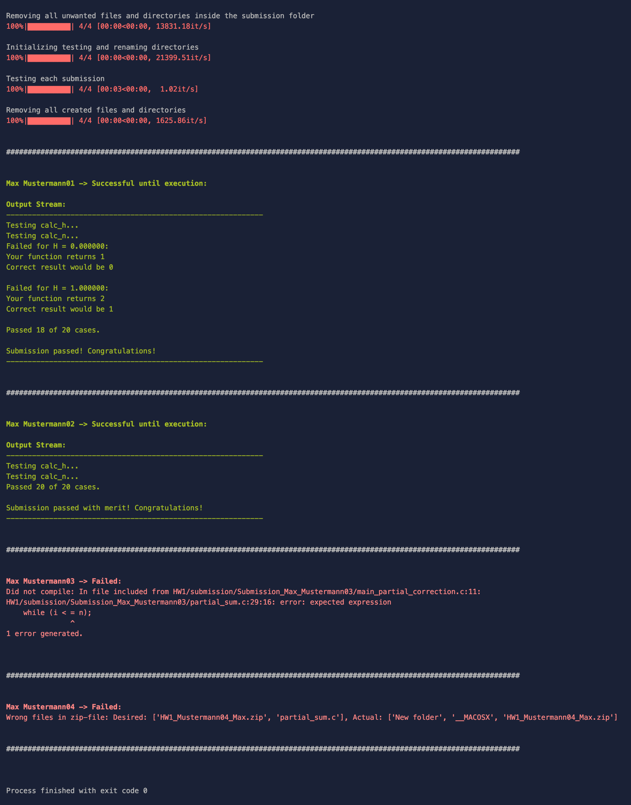

# AutoCorrector for Engineering Informatics 1

This project runs on `python 3.7`.

<br/>

Install all requirements with:

```bash
pip install -r requirements.txt
```

Run the tests with:
```bash
python3 __init__.py 
```

<br/>

### File Structure

Inside the directory **`Helpers`** you can find Helper Library which are not specifically part of this usecase.

Inside **`Example_for_HW1`** you can find an example for how the console- and the markdown-output might look like in homework 01.

Inside **`HW1`** you can find the actual submission files used to demonstrate this tool.

Inside **`Testing`** you can find the actual testing-procedure.


<br/>

### Setup

Inside **`config.py`** you can set the homeworks requirements (which files do they need to submit, which files do we give them, e.g. `main.c`?).


You have two specific two directories inside `config.py`:

* **`GIVEN_DIRECTORY`**: Inside here you put all the files that have been provided for this homework -> The ones they didn't have to write by themselves, e.g. the testing `main`-file
* **`SUBMISSION_DIRECTORY`**: Inside here you put each submittees folder that you've downloaded from moodle -> In here are all the `…_assignsubmission_file_`-folders


You also have to list:

* **`GIVEN_FILES`**: Which files did we provide?
* **`SUBMISSION_FILES`**: Which files have to be in the submission files (more files are allowed)


Lastly you have to specify which files need to be compiled in `FILES_TO_COMPILE`.


<br/>

### Usage

Copy all files into the folders `HW.../given` and `HW.../submission` (See the example for HW1 for that).
Inside `Testing/__init__.py` specify which `config_....py` to use.

Once you’ve set up the configuration you can run the file `AutoCorrection.__init__.py`.

The test protocol will be generated at the location you’ve specified in `PROTOCOL_LOCATION`.


<br/>

### Testing Procedure

I store all results in a python dictionary - similar to a hash table.


Roughly the testing procedure:

1. Renaming all folders
2. Test 1: Is there exactly one zip-file?
3. Test 2: Does the zip-file contain all the required files?
4. Test 3: Does Compilation work as expected?
5. Execute the file and store the generated output
6. Removing all created files and directories
7. Generating a markdown protocol
8. Printing out the protocol 


Only a short version of the test protocol will be printed out to the console. Example for HW1:



